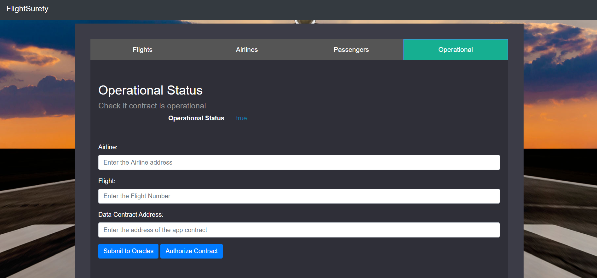

# FlightSurety

FlightSurety is a sample application project for Udacity's Blockchain course.

## Getting Started

Via this dapp, passengers on a flight can purchase insurance for their flight and receive a refund if there is a delay due to the airline.

The refund is not automatically sent to the passenger, but kept within the contract until the passenger requests a withdrawal.

Airlines can register other airline companies, register flights and deposit an activation fee.

Anyone can donate funds to the contract so that it can continue to be sustained.

The flight number and the airline that registered it are used to uniquely identify a flight.

## Install

This repository contains Smart Contract code in Solidity (using Truffle), tests (also using Truffle), dApp scaffolding (using HTML, CSS and JS) and server app scaffolding.

To install, download or clone the repo, then:

`npm install`
`truffle compile`

## Develop Client

To run truffle tests:

`truffle test ./test/flightSurety.js`
`truffle test ./test/oracles.js`

To use the dapp:

`truffle migrate`
`npm run dapp`

To view dapp:

`http://localhost:8000`

## Develop Server

`npm run server`
`truffle test ./test/oracles.js`

## Deploy

To build dapp for prod:
`npm run dapp:prod`

Deploy the contents of the ./dapp folder

## Tests

This repository also contains a js file with 18 tests covering all the functionality required by the project.

Here is an example of a test:

```
it("(passengers) Passengers may pay up to 1 ether for purchasing flight insurance:", async () => {
        let flight = 'ND1309';
        let passeger = accounts[6];
        let insuranceValue = web3.utils.toWei("0.5", "ether");

        await config.flightSuretyApp.buy(config.firstAirline, flight, {
            from: passeger,
            value: insuranceValue,
            gasPrice: 0
        });
        const resultBuffer = await config.flightSuretyData.fetchFlightInsured.call(passeger, config.firstAirline, flight);

        // Verify the result set
        assert.equal(resultBuffer[0], true, 'Error: Invalid value isRegistered');
        assert.equal(resultBuffer[1], insuranceValue, 'Error: Missing or Invalid timestamp');
        assert.equal(resultBuffer[2], 0, 'Error: Missing or Invalid airline address');
    });
```

### Front-End Instruction

The interface to use the contract is divided into different sections, one for each "entity" that interacts with the contract (Airlines, Passengers, Flights ...)





## Resources

* [How does Ethereum work anyway?](https://medium.com/@preethikasireddy/how-does-ethereum-work-anyway-22d1df506369)
* [BIP39 Mnemonic Generator](https://iancoleman.io/bip39/)
* [Truffle Framework](http://truffleframework.com/)
* [Ganache Local Blockchain](http://truffleframework.com/ganache/)
* [Remix Solidity IDE](https://remix.ethereum.org/)
* [Solidity Language Reference](http://solidity.readthedocs.io/en/v0.4.24/)
* [Ethereum Blockchain Explorer](https://etherscan.io/)
* [Web3Js Reference](https://github.com/ethereum/wiki/wiki/JavaScript-API)